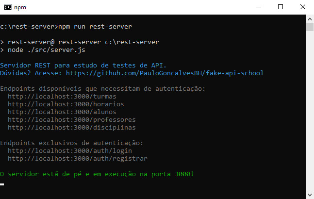

# Fake API School

### **Servidor REST para o QA estudar testes de API**
---

 Esse material disponibiliza um servidor REST com dados de uma escola fictícia permitindo o estudo do uso de token no header, manipulação de resposta, requisições aninhadas e todos os principais verbos.


Todos os endpoints disponíveis aceitam os verbos *GET, POST, PUT, PATCH* e *DELETE* e utilizam de token de autenticação no header.

## Sumário
- [Recursos existentes](#Recursos-existentes)
- [Instalação](#Instalação)
    - [Pré-requisitos](#Pré-requisitos)
    - [Clonando e instalando as dependências](#Clonando-e-instalando-as-dependências)
- [Subindo o servidor REST \o/](#Subindo-o-servidor-REST-\o/)
- [Consumindo os endpoints](#Consumindo-os-endpoints)
- [Arquivo de configuração](#Arquivo-de-configuração)
- [Preciso de ajuda](#Preciso-de-ajuda)

## Recursos existentes 

  <details><p><summary>Abra para ver todos os endpoints disponíveis</summary>

1. turmas
    1. id
    2. descricao
    3. idHorario
    4. alunos
        1. idAluno

2. horarios
    1. id
    2. turno
    3. segunda
    4. terca
    5. quarta
    6. quinta
    7. sexta

3. alunos
    1. id
    2. nome
    3. anoNascimento

4. professores
    1. id
    2. idDisciplina
    3. nome

5. disciplinas
    1. id
    2. nome

*Recursos exclusivos de autenticação:*

6. auth/login
7. auth/registrar

</p> </details>

> **Dica:** Pode ver os endpoints, exceto os de autenticação, direto no arquivo fonte [db.json](/data/db.json).

## Instalação
### Pré-requisitos

- [Git](https://git-scm.com/download/) e [Node.js](https://nodejs.org/en/download/) instalados.

### Clonando e instalando as dependências

Todos os comandos abaixo são feitos no _terminal_.

**1** - Faça um clone do repositório e acesse o diretório criado pelo clone:

```sh
git clone https://github.com/PauloGoncalvesBH/fake-api-school.git && cd fake-api-school
```

**2** - Execute o comando para instalar as dependências necessárias.

```sh
npm install --production
```

## Subindo o servidor REST \o/

Para iniciar o servidor e poder consumir os endpoints disponíveis é preciso enviar o seguinte comando:

```sh
npm run rest-server
```

Após isso surgirá as seguintes mensagens no terminal:



Pronto, já pode iniciar o seu estudo de testes de API \o/.

## Consumindo os endpoints

> **Dica:** As alterações são persistidas, porém ao reiniciar o servidor os dados irão voltar ao estado inicial.

Para poder consumir os serviços disponibilizados e listados [aqui](#Recursos-existentes) é preciso que esteja autenticado. Ou seja, consiga o token de acesso e passe ele no header da requisição.

Dessa forma, terá que lidar com os endpoints ```login``` e/ou ```registrar``` para que consiga o token que é enviado via resposta dos mesmos.

Envie uma requisição POST para qualquer um dos seguintes endpoints:

```
POST http://localhost:3000/auth/login
POST http://localhost:3000/auth/registrar
```

Passando o seguinte corpo:
``` json
{
  email: "paulo@email.com",
  password: "paulo"
}
```
Receberá o token na resposta:

``` json
{
  "accessToken": "<TOKEN>"
}
```
Envie esse token no header das requisições para que esteja autenticado:

```
  Authorization: Bearer <TOKEN>
```
Pronto, agora conseguirá consumir todos os endpoints disponibilizados.

> **Observaçôes:**
> - O tipo de autenticação utilizado é o Bearer.
> - O token possui tempo de duração. Veja mais na seção [Arquivo de configuração](#Arquivo-de-configuração).
> - Os usuários ficam armazenados no arquivo [users.json](/data/users.json).

### Exemplo de requisição fazendo o login e passando o token de autenticação retornado no header para uma requisição de GET no endpoint turmas:
``` javascript
  return frisby.post('http://localhost:3000/auth/login', {
    email: "paulo@email.com",
    password: "paulo"
  })
    .then((res) => {
      return frisby.setup({
        request: {
          headers: {
            'Authorization': `Bearer ${res.json.token}`
          }
        }
      }).get('http://localhost:3000/turmas/1')
    })
```
*Exemplo feito com o framework de testes [frisby.js](https://www.frisbyjs.com).*

### Dica

No terminal do servidor REST é apresentada algumas informações úteis das requisições realizadas.


## Arquivo de configuração

Foram disponibilizadas 3 configurações no arquivo [conf.js](/conf.js):
- Tempo de expiração do token. ```(Default: "1h")```
  - Ex.: ```"1000ms"```, ```60```, ```"60m"```, ```"24h"```, ```"365d"```, ```"1y"```. 
  - Um valor numérico é interpretado como segundos. Se você usar string informe a unidade de tempo (ms, s, m, h, d, y).
- Porta de acesso ao servidor. ```(Default: 3000)```
- Zoeira. O que será? Sete como true e inicie o servidor. ```(Default: false)```

## Preciso de ajuda

Está com algum problema e precisa de ajuda? Abra uma [issue aqui](https://github.com/PauloGoncalvesBH/fake-api-school/issues) detalhando a sua situação e irei te ajudar 😊.

---

[MIT License](./LICENSE)