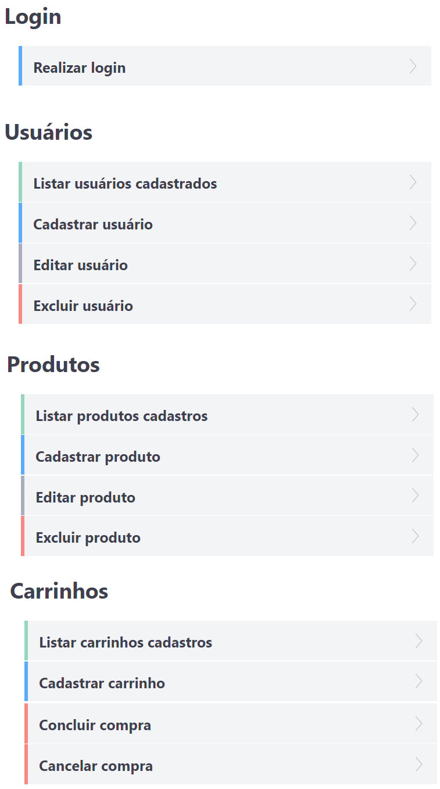

<h1 align="center">ServeRest</h1>

**Servidor REST local de forma rápida e simples para estudo de testes de API**

[](https://npmjs.com/package/serverest)
[](https://bettercodehub.com/results/PauloGoncalvesBH/serverest)
[](https://github.com/PauloGoncalvesBH/serverest/actions)
[](https://npmjs.com/package/serverest)
[](https://app.fossa.io/projects/git%2Bgithub.com%2FPauloGoncalvesBH%2Fserverest?ref=badge_shield)

---

## Executando o ServeRest

```sh
npx serverest@2
```

Dispõe de um servidor REST com dados de e-commerce fictício, permitindo o estudo do uso de:
- Verbos *GET, POST, PUT* e *DELETE*
- Autenticação no header
- Query string
- Contrato
- Manipulação de resposta
- Requisições aninhadas

## Links

- **[Histórico de alterações](/CHANGELOG.md)**
- [Código de conduta](/CODE_OF_CONDUCT.md)
- [Como contribuir](/CONTRIBUTING.md)

## Rotas disponíveis

Ao iniciar o _ServeRest_ automaticamente a rota `/api-doc` é executada, abrindo a documentação, que lista todas as rotas, verbos, contratos e repostas possíveis.

<details><summary>Abra para ver imagem das rotas disponíveis</summary>



---

</details>

> Para evitar que a documentação seja aberta automaticamente envie o comando `npx serverest --nodoc`

## Configuração

Para visualizar as configurações que são possíveis de serem feitas execute o comando

```sh
npx serverest -h
```

<details><summary>Abra para ver imagem do terminal com os comandos de configuração</summary>


---

</details>

## (Dica) Gerenciando versão

Como o comando `npx serverest` sempre executa a última versão disponibilizada, é interessante fixar qual versão que deseja utilizar, pois pode ocorrer da sua automação funcionar na versão `2.X.X` e ter sido disponibilizada a versão `3.X.X`, o que pode resultar na quebra dos seus testes.

#### Para utilizar a versão major 2.X.X

_Essa é a versão atual do ServeRest_

```sh
npx serverest@2
```

#### Para utilizar a versão major 1.X.X

```sh
npx serverest@1
```

## Licença

[](https://app.fossa.io/projects/git%2Bgithub.com%2FPauloGoncalvesBH%2Fserverest?ref=badge_large)
