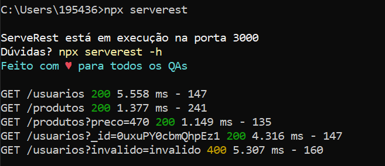

<h1 align="center">ServeRest</h1>

<h5 align="center">Servidor REST local de forma rápida e simples para estudo de testes de API</h5>

[](https://npmjs.com/package/serverest)
[](https://bettercodehub.com/results/PauloGoncalvesBH/serverest)
[](https://github.com/PauloGoncalvesBH/serverest/actions)
[](https://npmjs.com/package/serverest)
[](https://app.fossa.io/projects/git%2Bgithub.com%2FPauloGoncalvesBH%2Fserverest?ref=badge_shield)

[Histórico de alterações](/CHANGELOG.md) **|** [Como contribuir](/CONTRIBUTING.md) **|** [Código de conduta](/CODE_OF_CONDUCT.md)

## Executando o ServeRest

```sh
npx serverest
```

<details><summary>Abra para ver imagem do <i>ServeRest</i> iniciado e com algumas requests realizadas</summary>



</details>

Permite o estudo de:
- Verbos *GET, POST, PUT* e *DELETE*
- Autenticação no header
- Boas práticas de segurança
- Query string
- Contrato
- Requisições aninhadas

## Rotas disponíveis

Acesse <https://serverest.js.org> para ter acesso à documentação de todas as rotas, verbos, contratos e respostas possíveis.

<details><summary><i>Abra para ver imagem resumida das rotas disponíveis</i></summary>


---

</details>

#### Documentação local

Ao iniciar o _ServeRest_ automaticamente a rota `/api-doc` é executada, abrindo a documentação localmente em `http://localhost:{porta}/api-doc`

Para evitar que a documentação seja aberta automaticamente envie o comando `npx serverest --nodoc`

## Configuração

Para visualizar as configurações que são possíveis de serem feitas execute o comando

```sh
npx serverest -h
```

<details><summary><i>Abra para ver imagem do terminal com os comandos de configuração</i></summary>


</details>

#### Segurança (`--nosec`)

É boa prática que as APIs, na resposta, enviem determinados cabeçalhos e suprimam outros visando a segurança da aplicação.

Por default, o _ServeRest_ irá fazer as seguintes alterações de segurança, que podem ser desabilitadas com `npx serverest --nosec`:

**Cabeçalhos adicionados:**
- `Strict-Transport-Security: max-age=15552000; includeSubDomains`
- `X-Content-Type-Options: nosniff`
- `X-DNS-Prefetch-Control: off`
- `X-Download-Options: noopen`
- `X-Frame-Options: SAMEORIGIN`
- `X-XSS-Protection: 1; mode=block`

**Cabeçalho removido:**
- `X-Powered-By: Express`

Utilize esse comportamento para realizar testes de segurança, validando a presença/ausência desses cabeçalhos.

> Para saber mais leia o [checklist de segurança de API](https://github.com/shieldfy/API-Security-Checklist#api-security-checklist)

## Licença

[](https://app.fossa.io/projects/git%2Bgithub.com%2FPauloGoncalvesBH%2Fserverest?ref=badge_large)
