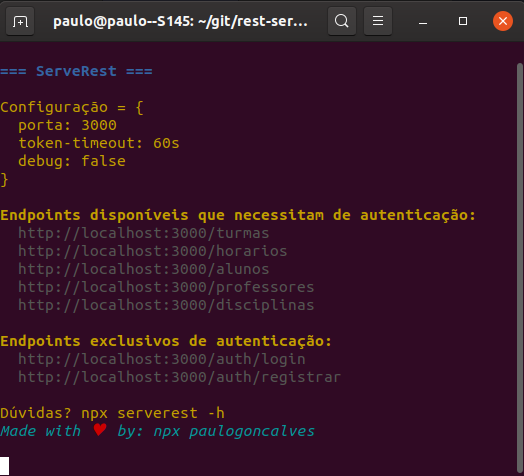
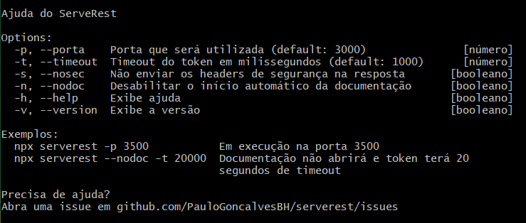

# ServeRest

### **Servidor REST local para estudo de testes de API**

[](http://commitizen.github.io/cz-cli/)

---

 Dispõe de um servidor REST com dados de escola fictícia, permitindo o estudo do uso de autenticação, manipulação de resposta, requisições aninhadas e principais verbos.

Todos os endpoints disponíveis aceitam os verbos *GET, POST, PUT, PATCH* e *DELETE* e utilizam de token de autenticação no header.

## Executando o ServeRest

Para iniciar o _ServeRest_ envie o seguinte comando:

```sh
npx serverest
```

Após isso surgirão as seguintes mensagens no terminal:



Pronto, já pode iniciar o seu estudo de testes de API \o/.

> Não tem teste de API pronto pra executar e testar o servidor? Visite a seção [Exemplo de teste utilizando o ServeRest](#exemplo-de-teste-utilizando-o-ServeRest).

## Sumário
- [Executando o ServeRest](#executando-o-serverest)
- [Ajuda](#ajuda)
- [Configuração](#config)
    - [Exemplos](#exemplos)
- [Recursos existentes](#recursos-existentes)
- [Consumindo os endpoints](#consumindo-os-endpoints)
    - [Dica](#dica)
- [Performance](#performance)
- [Debug](#debug)
- [Exemplo de teste utilizando o ServeRest](#exemplo-de-teste-utilizando-o-serverest)
- [Preciso de ajuda](#preciso-de-ajuda)

## Ajuda

Para visualizar todos os comandos existentes, como utilizar e exemplos, execute o comando

```sh
npx serverest -h
```

<details><summary>Abra para ver imagem do terminal após o comando de ajuda</summary>



</details>

## Config

É possível definir algumas configurações, que são:
- Tempo de expiração do token em milissegundos. ```(Default: 1000)```
- Porta utilizada pelo servidor. ```(Default: 3000)```
- Debug, que imprime dados de requisições no console. ```(Default: false)```
> Sobre debug, veja mais na seção [Debug](#debug).

Para subir o **ServeRest** com determinada configuração, envie o comando de início do servidor com a respectiva configuração, como:
- Timeout do token: `-t` ou `--timeout`
  - `npx serverest --timeout 4000`
- Porta: `-p` ou `--porta`
  - `npx serverest --porta 3030`
- Debug: `-d` ou `--debug`
  - `npx serverest -d`

Os comandos de timeout, porta e debug podem ser combinados e a ordem não importa.

> As configurações são apresentadas no terminal ao subir o servidor

### Exemplos

Servidor na `porta` 3030 e em modo de `debug`:
```sh
npx serverest -p 3030 -d
```

Servidor em modo de `debug` e 2 segundos de `timeout`:
```sh
npx serverest -d --timeout 2000
```

## Recursos existentes 

  <details><p><summary>Abra para ver todos os endpoints disponíveis</summary>

1. turmas
    1. id
    2. descricao
    3. idHorario
    4. alunos
        1. idAluno

2. horarios
    1. id
    2. turno
    3. segunda
    4. terca
    5. quarta
    6. quinta
    7. sexta

3. alunos
    1. id
    2. nome
    3. anoNascimento

4. professores
    1. id
    2. idDisciplina
    3. nome

5. disciplinas
    1. id
    2. nome

*Recursos exclusivos de autenticação:*

6. auth/login
7. auth/registrar

</p> </details>

> **Dica:** Pode ver os endpoints, exceto os de autenticação, direto no arquivo fonte [db.json](/data/db.json).

## Consumindo os endpoints

> **Dica:** As alterações são persistidas, para voltar ao estado inicial reinicie o **ServeRest**.

Para poder consumir os serviços disponibilizados e listados [aqui](#recursos-existentes) é preciso que esteja autenticado. Ou seja, consiga o token de acesso e passe ele no header da requisição.

Dessa forma, terá que lidar com os endpoints ```login``` e/ou ```registrar``` para que consiga o token que é enviado via resposta dos mesmos.

Envie uma requisição POST para qualquer um dos seguintes endpoints:

```
POST http://localhost:3000/auth/login
POST http://localhost:3000/auth/registrar
```

Passando o seguinte corpo:
``` json
{
  email: "paulo@email.com",
  password: "paulo"
}
```
Receberá o token na resposta:

``` json
{
  "accessToken": "<TOKEN>"
}
```
Envie esse token no header das requisições para que esteja autenticado:

```
  Authorization: Bearer <TOKEN>
```
Pronto, agora conseguirá consumir todos os endpoints disponibilizados.

> **Observaçôes:**
> - O tipo de autenticação utilizado é o `Bearer`.
> - O token possui tempo de duração. Veja mais na seção [configuração](#config).
> - Os usuários ficam armazenados no arquivo [users.json](/data/users.json).

Exemplo de requisição fazendo o login e passando o token de autenticação retornado no header para uma requisição de GET no endpoint turmas:
``` javascript
  return frisby.post('http://localhost:3000/auth/login', {
    email: "paulo@email.com",
    password: "paulo"
  })
    .then((res) => {
      return frisby.setup({
        request: {
          headers: {
            'Authorization': `Bearer ${res.json.token}`
          }
        }
      }).get('http://localhost:3000/turmas/1')
    })
```
*Exemplo feito com o framework de testes [frisby.js](https://www.frisbyjs.com).*

### Dica

No terminal são apresentadas algumas informações úteis das requisições realizadas.


## Performance

A cada inicialização do servidor utilizando `npx` é realizado o download e a instalação das dependências necessárias, demandando tempo próximo de 20 segundos (boa conexão de rede e SSD).

Para ter rápido início do servidor, instale o **ServeRest** globalmente:

```sh
npm install -g serverest@latest
```
Dessa forma, ao iniciar o servidor não haverá download e instalação, ocorrendo apenas o consumo do pacote baixado globalmente.

## Debug
 Foi implementado debug que imprime no console as informações da requisição feita ao endpoint.

> Atente que a opção de debug imprime apenas os dados da requisição, e não da resposta.

*Exemplo de informação impressa no console com o modo debug ativado:*

 

 A informação de debug fica sempre logo acima da informação de resposta. Como pode ver no print acima, a requisição que teve o header e o body impressos foi finalizada com status 200.

## Exemplo de teste utilizando o ServeRest

 Caso queira testar o **ServeRest** e não tem tempo para criar testes de API, visite [esse repositório](https://github.com/PauloGoncalvesBH/api-test). Em poucos minutos terá o servidor de pé e os testes sendo executados.

## Preciso de ajuda

Está com algum problema e precisa de ajuda? Abra uma [issue aqui](https://github.com/PauloGoncalvesBH/serverest/issues) detalhando a sua situação e irei te ajudar 😊.

---

_Made with ♥ by npx paulogoncalves_

[MIT License](./LICENSE)
